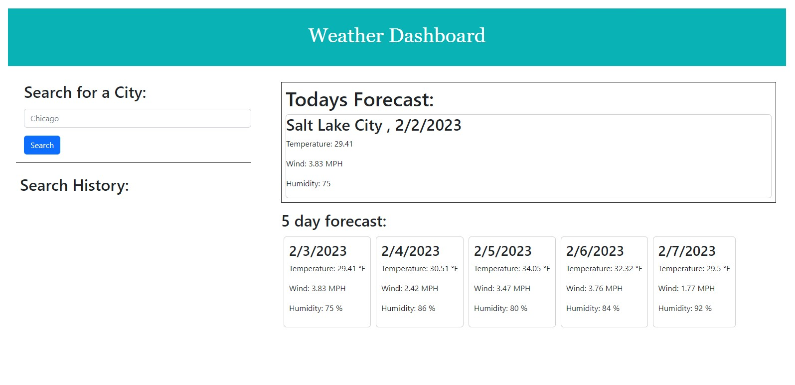

# Weather Dashboard

#### Description

A simple way to search the weather for a specific city. Allows an easy, clean way to see the weather without seeing all the ads and additional content from other/bigger sites.

After creating this dashboard, I have learned to basics and requirements need to make API calls using fetch and server-side APIs.

## Installation

NA

## Usage

Type in the name of the city whose current weather and forecast you would like to view. From there you will be displayed with cards containing the temperature, wind and humidity.

## License

NA

## Contact

https://github.com/PaigeWing
